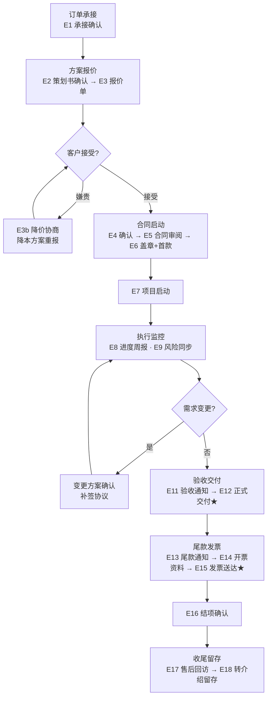

# 订单邮件工作流

> 适用范围：量潮数据订单从**承接**到**收尾**的完整商务流程。
> 原则：**每一步关键节点均以邮件书面确认**——既是对客户的正式承诺，也是公司内部留痕与审计依据（见《量潮数据审计章程》检查项：策划书确认、报价确认、进度汇报、交付邮件、尾款催收记录）。
> 节点编号：E1 至 E18，E 为 Email 的缩写，一个编号对应一封邮件。

## 角色

| 角色 | 邮件职责 |
|------|----------|
| 商务经理 | 承接、报价、合同、发票、尾款邮件（本工作流主导者） |
| 项目经理（PM） | 进度汇报、风险同步、验收与交付邮件 |
| 销售 | 成交前沟通；成交后向商务移交（不直接参与后续邮件） |
| 财务 | 开票、到账确认（配合商务） |

## 工作流总览



★ = 已有邮件（交付、开发票），本流程中已归位并保持一致。

---

## 阶段一：订单承接

### E1 承接确认

- **触发**：销售成交、客户确认合作意向，商务接手
- **发件人**：商务经理
- **邮件标题**：`[项目名称] - 合作承接确认与信息收集`

```text
X老师您好，

感谢您选择量潮数据。我是本项目的商务负责人XXX，后续由我为您跟进合作事宜。

为准确评估方案，请您提供以下信息（如有资料可直接回复附件）：
1. 数据现状：数据来源平台/网站、已有数据形式
2. 期望结果：希望获得的数据集或代码
3. 数据量级与时间要求（如有）

我们将在收到资料后X个工作日内，为您整理项目策划书与初步报价。

如有任何问题，随时与我联系。
量潮数据 商务 XXX
[日期]
```

- **期望响应**：客户提供资料；**48 小时未回复** → 微信/飞书跟进提醒一次

---

## 阶段二：方案报价

### E2 策划书确认

- **触发**：策划书撰写完成
- **发件人**：商务经理 / PM
- **邮件标题**：`[项目名称] - 项目策划书（请确认）`

```text
X老师您好，

根据您的需求，我们已完成项目策划书，请查收附件。

请重点确认以下两项：
1. 交付范围：交付物（数据集/代码）与字段清单
2. 时间规划：预计工期与交付时间

如无异议请回复确认，我们将进入报价流程；如需调整，请直接标注反馈，我们将在X个工作日内修订。

量潮数据 [姓名]
[日期]
```

- **期望响应**：客户确认或反馈修改意见；反复修改需控制轮次，三轮未收敛 → 电话沟通对齐

### E3 商务报价单

- **触发**：技术评估工时完成、商务出报价单
- **发件人**：商务经理
- **邮件标题**：`[项目名称] - 商务报价单`

```text
X老师您好，

基于技术评估，报价单已出具，请查收附件。

报价说明：
1. 报价构成：按[难度/数据量级/工时]公式化计算，价格构成详见报价单
2. 付款节点：首款XX%、中期XX%、尾款XX%，以合同约定为准
3. 变更规则：需求字段或范围变更时，将按报价公式重新核算并书面确认

请您审阅，如有任何疑问随时沟通。
量潮数据 商务 XXX
[日期]
```

- **期望响应**：客户接受 / 协商

### E3b 降价协商（分支）

- **触发**：客户嫌贵或要求降价
- **发件人**：商务经理
- **邮件标题**：`[项目名称] - 关于报价的沟通`

```text
X老师您好，

收到，我们理解预算方面的考虑。我这边内部重新评估一下需求范围，看看是否有降本方案可以给您选择，预计X个工作日内回复。

降本思路（供参考）：在不影响核心交付的前提下，可精简非核心模块、缩小数据采集范围或简化交付标准。
```

- **内部动作**：技术评估可精简项与对应省时 → 商务重出报价单
- **重新报价后**：
  - 接受 → 进入合同流程
  - 仍不接受 → 礼貌收尾，留有余地：

```text
X老师您好，

好的，理解。后续如果有类似需求或预算调整，随时可以再联系我们。祝您项目顺利！
```

### E4 报价确认

- **触发**：客户接受报价
- **发件人**：商务经理
- **邮件标题**：`[项目名称] - 报价确认与合同安排`

```text
X老师您好，

感谢确认报价。我们接下来将起草商务合同，合同将明确交付范围、付款节点、验收时限与双方责任，起草完成后发您审阅。

如需调整合同细节，欢迎届时提出。
量潮数据 商务 XXX
[日期]
```

---

## 阶段三：合同启动

### E5 合同审阅

- **触发**：合同起草完成
- **发件人**：商务经理
- **邮件标题**：`[项目名称] - 商务合同（请审阅）`

```text
X老师您好，

合同已起草完成，请查收附件。

请重点审阅：交付范围、交付物清单、付款节点（首款/中期/尾款）、验收时限与违约条款。

确认无误后请回复"确认"，我们将安排盖章并寄送。
量潮数据 商务 XXX
[日期]
```

### E6 合同盖章 + 首款提醒

- **触发**：双方确认合同
- **发件人**：商务经理
- **邮件标题**：`[项目名称] - 合同已盖章，请安排首付款`

```text
X老师您好，

合同已完成盖章，扫描件请查收附件（原件将随[快递方式]寄出）。

请您确认合同无误后安排支付首款：¥XX,XXX（占总费用XX%），收款账户见附件/合同。

首款到账后我们将立即安排技术启动，预计交付时间不变。
量潮数据 商务 XXX
[日期]
```

- **期望响应**：客户付款回执；**7 天未到账** → 商务跟进催款一次（记录于项目档案）

### E7 项目启动

- **触发**：首款到账
- **发件人**：商务经理 / PM
- **邮件标题**：`[项目名称] - 项目正式启动`

```text
X老师您好，

首款已确认到账，[项目名称]正式启动。

后续安排：
1. 项目负责人：PM XXX（邮箱/电话）
2. 进度同步：每周向您发送进度报告
3. 预计交付时间：[日期]

过程中如有任何问题，可随时联系 PM 或直接回复本邮件。
量潮数据 [姓名]
[日期]
```

---

## 阶段四：执行监控

### E8 定期进度汇报（周报）

- **触发**：每周/每两周（合同约定周期）
- **发件人**：PM
- **邮件标题**：`[项目名称] - 进度周报（第X期）`

```text
X老师您好，

本周进度同步如下：
- 已完成：[量化描述，如"数据采集 32/543 组"]
- 进行中：[当前任务]
- 待您配合：[如无填"暂无"]
- 预计交付时间：[不变/调整说明]

如有需要您决策的事项会单独与您沟通。随时欢迎反馈。
量潮数据 PM XXX
[日期]
```

- **原则**：主动透明、暴露风险；进度异常时第一时间同步而非拖到交付前

### E9 风险与问题同步

- **触发**：出现卡点、风险或需客户决策事项
- **发件人**：PM
- **邮件标题**：`[项目名称] - 项目风险同步与方案确认`

```text
X老师您好，

同步一个项目情况：
- 问题/风险：[描述]
- 影响：[对工期/交付物/成本的影响]
- 建议方案：[方案A/B及差异]
- 请您确认：[需要您决策/配合的事项，注明时限]

确认后我们将按方案执行，并以本邮件作为书面依据。如您有其他考虑请回复告知。
量潮数据 PM XXX
[日期]
```

### E10 需求变更（分支）

- **触发**：客户提出需求变更
- **发件人**：商务经理 / PM
- **邮件标题**：`[项目名称] - 需求变更方案与成本评估`

```text
X老师您好，

收到您的变更需求：[变更内容]。

经评估，变更影响如下：
1. 范围影响：[新增/调整的字段、模块]
2. 工期影响：[工期延长X天 / 不变]
3. 费用影响：[按报价公式核算的增减金额]

如确认变更，请回复"确认"；我们将同步更新项目计划并（如需）补签变更协议。变更以书面确认为准。
量潮数据 [姓名]
[日期]
```

---

## 阶段五：验收交付

### E11 验收通知

- **触发**：技术完成开发、内部验收通过
- **发件人**：PM
- **邮件标题**：`[项目名称] - 交付物验收通知`

```text
X老师您好，

项目已按约定完成，交付物与验收实例请查收附件/链接。

请根据合同约定的验收标准进行验证，并请于X个工作日内回复验收结论。根据合同约定，超期未反馈视为验收通过。

确认验收后，我们将安排正式交付。
量潮数据 PM XXX
[日期]
```

### E12 正式交付 ★（已有 · 飞书正式模板）

- **触发**：客户验收通过（尾款结清后交付全部成果）
- **发件人**：PM / 商务经理
- **邮件标题**：`[项目名称] - 项目交付物`

```text
尊敬的 XXX老师/XXX总：

您好！

（此处根据客户情况添加寒暄语，例如感谢项目期间的配合、感谢提出的建议等。）

根据双方确认的项目需求，本项目现已完成开发及内部验收，现正式向您交付本次项目成果。

本次交付文件详见邮件附件，请您查收。

如您在验收过程中发现任何问题，或有需要进一步完善的地方，欢迎随时与我们联系，我们将第一时间协调处理。

根据双方合同约定，本项目现已进入验收阶段。如验收无误，烦请协助安排尾款支付。如需开具发票，请及时告知，我们将积极配合办理。

（此处根据客户情况添加结束语，例如期待合作、祝科研顺利、祝工作顺利等。）

感谢您的支持！

此致

敬礼！

量潮科技
商务经理：XXX
联系方式：XXXXXXXX
```

**可替换寒暄语（开头）**：

| 客户类型 | 寒暄语 |
|----------|--------|
| 高校老师 | 感谢您在项目执行期间提出的宝贵建议，也感谢您一直以来对量潮科技的信任与支持。／感谢您在项目执行过程中给予我们的耐心沟通与配合。 |
| 企业客户 | 感谢贵司在项目实施期间的积极配合，也感谢贵司对量潮科技的信任。 |
| 长期合作客户 | 感谢您一直以来对量潮科技的支持，很高兴本次项目能够顺利完成。 |

> 模板出处：飞书工作档案《交付正式邮件模板》

---

## 阶段六：尾款发票

### E13 尾款支付通知

- **触发**：客户确认交付物无误
- **发件人**：商务经理
- **邮件标题**：`[项目名称] - 尾款支付通知`

```text
X老师您好，

感谢确认交付物。请您安排支付尾款：¥XX,XXX（占总费用XX%），收款账户同合同。

如需开具发票，请同时提供开票资料（抬头、税号、注册地址、电话、开户行及账号），我们将同步处理。

尾款到账后，本项目即完成结项。
量潮数据 商务 XXX
[日期]
```

### E14 开票资料收集

- **触发**：客户需开发票（或在 E13 中未提供资料）
- **发件人**：商务经理
- **邮件标题**：`[项目名称] - 请提供开票资料`

```text
X老师您好，

为尽快为您开具发票，请提供以下开票资料：
1. 发票类型：增值税专用发票 / 普通发票
2. 发票抬头（单位全称）：
3. 纳税人识别号：
4. 注册地址及电话：
5. 开户行及账号：
6. 收票邮箱/地址：

资料齐全后，我们将在X个工作日内开具并发送发票。
量潮数据 商务 XXX
[日期]
```

### E15 发票送达 ★（已有 · 飞书正式模板）

- **触发**：财务完成开票
- **发件人**：商务经理（配合财务）
- **邮件标题**：`[项目名称] - 发票已开具`

```text
尊敬的 XXX 老师 / XXX 总：

您好！

（此处根据客户情况添加寒暄语，例如感谢项目期间的配合、感谢提出的建议等。）

根据双方确认的项目约定，本项目对应服务发票现已开具完成，现随邮件附上本次项目发票。本次发票文件详见邮件附件，请您查收。

如您核对发票信息过程中发现信息有误，欢迎随时与我们联系，我们将第一时间协调处理重开。

根据双方合同约定，烦请收到发票后按合同约定安排对应款项支付。若有其他资料需求，请及时告知，我们将积极配合办理。

（此处根据客户情况添加结束语，例如期待后续合作、祝科研顺利、祝工作顺利等。）

感谢您的支持！

此致

敬礼！

量潮科技
商务经理：XXX
```

> 模板出处：飞书工作档案《发票发送正式邮件模板》

### E16 结项确认

- **触发**：尾款到账
- **发件人**：商务经理
- **邮件标题**：`[项目名称] - 项目结项确认`

```text
X老师您好，

尾款已确认到账，[项目名称]正式结项。感谢您本次的信任与合作！

结项说明：
1. 项目档案（策划书、合同、交付记录、发票）已归档
2. 交付后我们提供[XX天]的答疑支持，数据使用问题欢迎随时提出

期待后续继续为您服务。
量潮数据 商务 XXX
[日期]
```

---

## 阶段七：收尾留存

### E17 售后支持与回访

- **触发**：交付后X周（售后期内）
- **发件人**：商务经理 / PM
- **邮件标题**：`[项目名称] - 交付后支持与回访`

```text
X老师您好，

[项目名称]已交付一段时间，特此回访：
1. 交付数据在使用中是否顺利？如有疑问我们提供答疑支持
2. 本次合作中，有哪些环节您觉得可以做得更好？欢迎直言

您的反馈将帮助我们持续改进，感谢您的宝贵时间。
量潮数据 [姓名]
[日期]
```

### E18 转介绍与长期合作

- **触发**：项目圆满结项、客户满意度确认后（非打扰性发送）
- **发件人**：商务经理
- **邮件标题**：`感谢您的信任 - 量潮数据长期合作邀请`

```text
X老师您好，

再次感谢您对[项目名称]的信任。为回馈长期合作客户，我们提供以下服务：

1. 学术圈推荐：如您的同事/圈内朋友有数据处理需求，欢迎推荐，我们将优先安排并给予双方[优惠说明]
2. 数据报告：我们可基于本次项目沉淀的方法，为您的后续研究提供标准化服务
3. 其他服务：数据云、课程培训等（如适用）

合作只是开始，期待与您长期同行。
量潮数据 商务 XXX
[日期]
```

---

## 工作流规则

1. **书面确认优先**：涉及范围、价格、工期、验收的节点，一律以邮件确认；口头沟通后补邮件留痕
2. **每封邮件包含**：项目名称、发件人及角色、明确的期望响应与时限
3. **时限与跟进**：关键邮件 48 小时未回复 → 微信/飞书提醒；付款类 7 天未到账 → 商务催收并记录
4. **邮件归档**：全部往来邮件按项目归档至客户群/项目档案，作为审计与复盘依据
5. **商务底线**：报价与降价由商务按规则执行（毛利底线、公式化报价），销售不直接参与后续商务邮件
